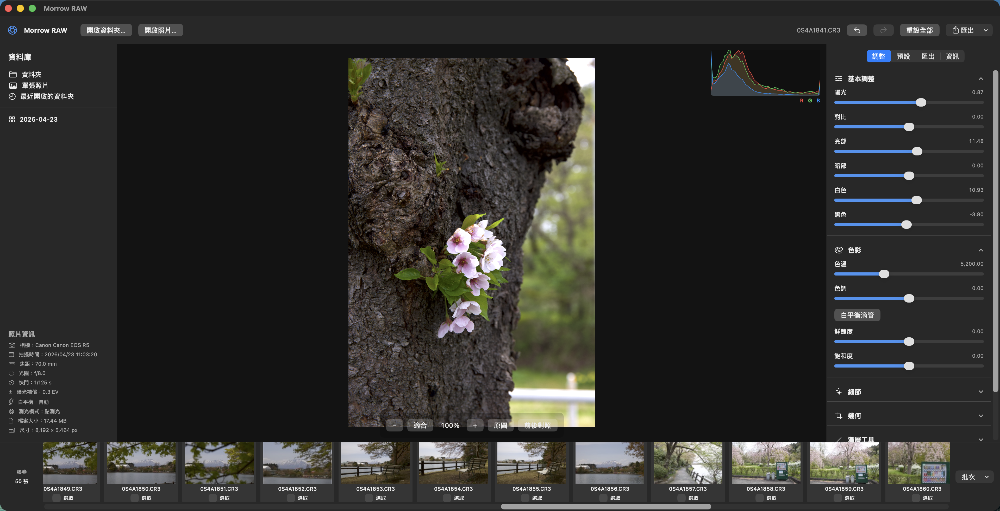

# Morrow RAW for macOS

Morrow RAW is a native macOS RAW photo editor built with SwiftUI, Core Image,
and Metal. It is designed for Apple Silicon and focuses on a responsive,
non-destructive workflow for browsing, editing, and exporting camera RAW files.

[繁體中文說明](README.zh-TW.md)

## Highlights

- Native RAW workflow with Core Image RAW decoding, metadata inspection, and
  persistent sidecar adjustments.
- Non-destructive editing with exposure and tonal controls, white-balance
  sampling, crop/rotation, gradient masks, healing points, presets, and
  Before/After comparison.
- Morrow Natural Color Assistant with explainable on-device color suggestions,
  waveform/vectorscope/clipping scopes, Vision-assisted semantic masks,
  ColorChecker camera calibration, and reference-photo matching.
- Batch editing and export for large folders, with cancellation, incremental
  progress, per-photo adjustments, metadata preservation, and JPEG/PNG/TIFF/BMP
  output.
- Apple Silicon rendering path using asynchronous Metal processing, shared
  texture pooling, bounded GPU concurrency, and adaptive preview resolution.

## Performance approach

The macOS implementation applies research-informed image-processing and systems
techniques where they improve interactive editing:

- Multi-scale previews reduce the amount of RAW data sent through the render
  graph while preserving full-resolution sources for export.
- Asynchronous, cancellable pipelines prevent folder scanning, thumbnail
  decoding, RAW loading, and preview rendering from blocking the UI.
- Texture reuse, bounded work queues, and cost-limited caches control GPU and
  memory pressure when browsing many high-resolution RAW files.
- Histogram work, metadata reads, and batch exports are scheduled separately so
  expensive analysis does not compete with direct user interaction.

The current implementation has been tested with Canon CR3 samples up to
8192×5464 pixels. Actual RAW compatibility depends on the camera model and the
Apple RAW decoder available on the host macOS version.

## Screenshots




## Build with Xcode

1. Open `Package.swift` in Xcode.
2. Select the `MorrowRAW` scheme.
3. Select a macOS My Mac destination.
4. Press Run.

For an Apple Silicon ARM64 app:

```sh
./build-app.sh
open dist/MorrowRAW.app
```

For an Apple Silicon DMG:

```sh
./package-dmg.sh
open dist/MorrowRAW-0.1.0-arm64.dmg
```

The legacy Universal 2 build remains available when Intel compatibility is
needed:

```sh
./build-universal-app.sh
open dist/MorrowRAW-universal.app
```

Build scripts use ad-hoc signing by default. A Developer ID can be supplied
for distribution builds:

```sh
SIGNING_IDENTITY="Developer ID Application: Your Name (TEAMID)" ./build-app.sh
```

Requirements: macOS 13 or later and Xcode 15 or later.

## Verification

```sh
swift test
swift build -c release
```

The project is not a signed or notarized release by default. macOS may require
the app to be opened from Finder with **Open**, or the quarantine attribute to
be removed for local testing:

```sh
xattr -dr com.apple.quarantine dist/MorrowRAW.app
open dist/MorrowRAW.app
```
